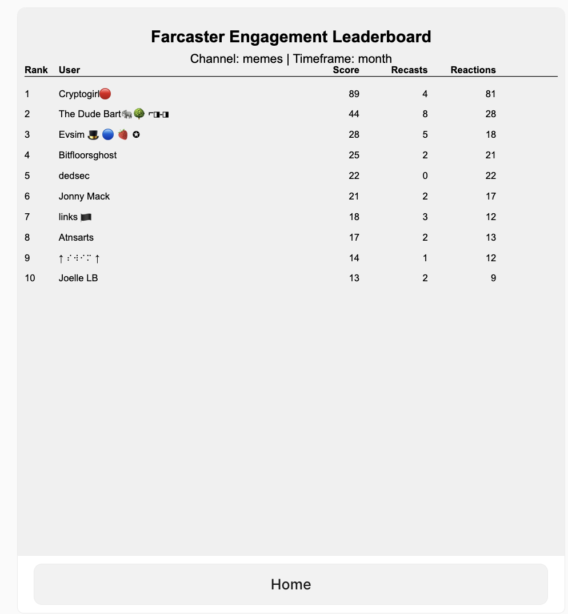

# Farcaster Engagement Leaderboard



This project implements a Farcaster Frame that displays an engagement leaderboard for Farcaster users. It allows users to view the top engaged users in a specific channel or across all channels for different time periods.

## Demo

You can see the live version of this frame at: https://frhck.vercel.app/

## Features

- View top engaged users in Farcaster
- Filter by channel (optional)
- Select timeframe (day, week, month)
- Display engagement metrics including score, recasts, and reactions

## Installation

To set up this project locally, follow these steps:

1. Clone the repository:
   ```
   git clone https://github.com/plotJ/farhack.git
   cd farhack
   ```

2. Install dependencies:
   ```
   npm install
   ```

3. Set up environment variables:
   Create a `.env.local` file in the root directory and add the following:
   ```
   NEYNAR_API_KEY=your_neynar_api_key
   LUM0X_API_KEY=your_lum0x_api_key
   NEXT_PUBLIC_HOST=http://localhost:3000
   ```

4. Run the development server:
   ```
   npm run dev
   ```

5. Open [http://localhost:3000/api/dev](http://localhost:3000/api/dev) in your browser to test the frame locally.

## Deployment

This project is deployed on Vercel. To deploy your own version:

1. Fork this repository
2. Sign up for a [Vercel account](https://vercel.com/signup)
3. Import your forked repository to Vercel
4. Set the environment variables in your Vercel project settings
5. Deploy!

## Technologies Used

- Next.js
- Frog
- Lum0x SDK
- Neynar API

## Contributing

Contributions are welcome! Please feel free to submit a Pull Request.

## License

This project is open source and available under the [MIT License](LICENSE).

## Contact

Created by [@plotJ](https://github.com/plotJ) - feel free to contact me!